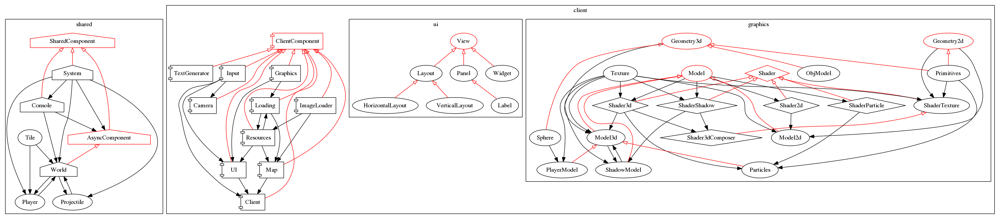
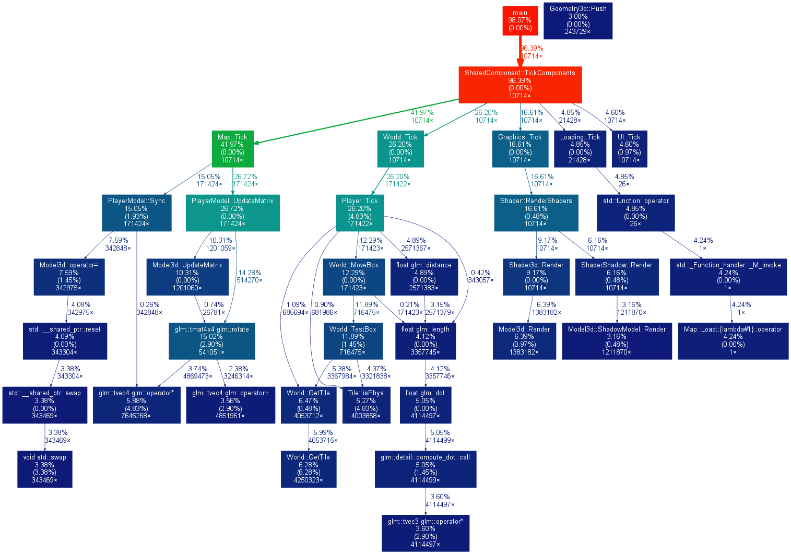

Teeworlds3d
===========

Teeworlds-like 3d game

## Building

You should:

- **Optionally:** export .blend models (from datasrc folder) into obj using triangle polygons with normals and UV coords and without materials in the data/models folder

- Compile using cl/gcc and libraries:

> - **On linux:** have g++, sdl2-dev, sdl2-image-dev, sdl2-ttf-dev, glew-dev installed.

> - **On windows:** have VisualStudio(cl.exe) installed, check compile.bat for variables.

- **On windows:** copy the DLLs from other folders in current folder

More info on [WIKI](https://github.com/AsGreyWolf/Teeworlds3d/wiki/Building)

## Structure

## Performance

Performance gprof graph (-O0):

